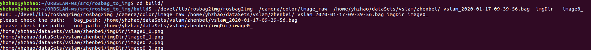

# rosbag_to_img
rosbag  topic to  image  by opencv


Build

```
mkdir -p build 
cd build 
cmake .. && make -j8 

````

Test 

```
run  topic_name  baf_dir  bag_name  outdir outname 
```

```
yhzhao@yhzhao:~/ORBSLAM-ws/src/rosbag_to_img/build$ ./devel/lib/rosbag2img/rosbag2img  /camera/color/image_raw  /home/yhzhao/dataSets/vslam/zhenbei/ vslam_2020-01-17-09-39-56.bag  imgDir   image0_
```


```shell
Run: ./devel/lib/rosbag2img/rosbag2img /camera/color/image_raw /home/yhzhao/dataSets/vslam/zhenbei/ vslam_2020-01-17-09-39-56.bag imgDir image0_
please check the path:   bag_path: /home/yhzhao/dataSets/vslam/zhenbei/vslam_2020-01-17-09-39-56.bag
please check the path:   out_path: /home/yhzhao/dataSets/vslam/zhenbei/imgDir/image0_
/home/yhzhao/dataSets/vslam/zhenbei/imgDir/image0_0.png
/home/yhzhao/dataSets/vslam/zhenbei/imgDir/image0_1.png
/home/yhzhao/dataSets/vslam/zhenbei/imgDir/image0_2.png


```




